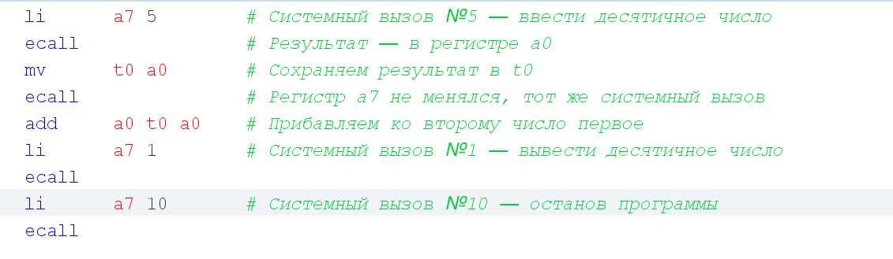

# Работа эмулятора

## Задача 1 (add-int01.s)&#x20;

<figure><figcaption>
Тело программы
</figcaption></figure>

<figure><figcaption>
Результат
</figcaption></figure>

## Задача 2 (hello01.s)

<figure><figcaption>
Тело программы
</figcaption></figure>

<figure><figcaption>
Результат
</figcaption></figure>

## Задача 3 (hello02.s)

<figure><figcaption>
Тело программы
</figcaption></figure>

<figure><figcaption>
Результат
</figcaption></figure>

## Задача 4 (hello03.s)

<figure><figcaption>
Тело программы
</figcaption></figure>

<figure><figcaption>
Результат
</figcaption></figure>

## Задача 5 (hello-ru.s)

<figure><figcaption>
Тело программы
</figcaption></figure>

<figure><figcaption>
Результат
</figcaption></figure>

## Задача 6 (add-int02.s)

<figure><figcaption>
Тело программы
</figcaption></figure>

<figure><figcaption>
Результат
</figcaption></figure>

